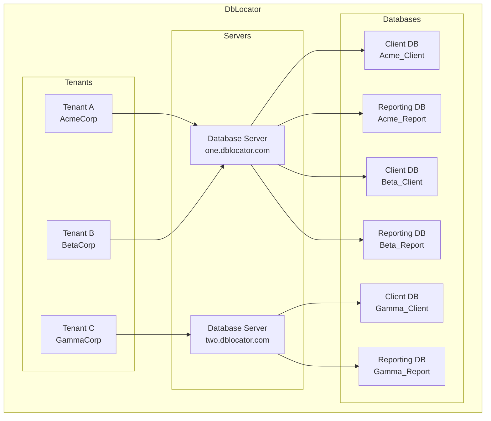

# DbLocator

DbLocator is a .NET library that simplifies database interactions for multi-database tenant applications on SQL Server.

## 📊 Architecture

### Diagram


## 📚 Documentation

Full documentation is available at [https://chizer1.github.io/DbLocator](https://chizer1.github.io/DbLocator)

## 🚀 Quick Start

### Installation

The package is available on [NuGet](https://www.nuget.org/packages/DbLocator):

```bash
dotnet add package DbLocator
```

### Basic Usage

```csharp
var connectionString = "{yourConnectionString}";
var dbLocator = new Locator(connectionString);

// Add a tenant
var tenantId = await dbLocator.CreateTenant(
    "Acme Corp",     // Name
    "acme",          // Code
    Status.Active    // Status
);

// Add a database type
var databaseTypeId = await dbLocator.CreateDatabaseType("Client");

// Add a database server
var databaseServerId = await dbLocator.CreateDatabaseServer(
    "Local SQL Server",    // Name
    "localhost",          // HostName
    "127.0.0.1",         // IP Address
    "localhost.local",    // FQDN
    false                 // Is Linked Server
);

// Add a database
var databaseId = await dbLocator.CreateDatabase(
    "Acme_Client",        // Database name
    databaseServerId,     // Server ID
    databaseTypeId,       // Database type ID
    true,                 // Auto-create database
    true                  // Use trusted connection
);

// Create a connection for the tenant
await dbLocator.CreateConnection(tenantId, databaseTypeId);

// Get the connection
using var connection = await dbLocator.GetConnection(tenantId, databaseTypeId);

// Example: Execute a query using the connection
using var command = connection.CreateCommand();
command.CommandText = "SELECT * FROM Users";
using var reader = await command.ExecuteReaderAsync();
```

## 📖 Examples

- [Example Project](https://github.com/chizer1/DbLocatorExample)
- [Full Documentation](https://chizer1.github.io/DbLocator)

## 🤝 Contributing

We welcome contributions! Here's how you can help:

1. Fork the repository
2. Create your feature branch (`git checkout -b feature/amazing-feature`)
3. Commit your changes (`git commit -m 'Add some amazing feature'`)
4. Push to the branch (`git push origin feature/amazing-feature`)
5. Open a Pull Request

Please read our [Contributing Guidelines](CONTRIBUTING.md) for more details.

## 📝 License

This project is licensed under the MIT License - see the [LICENSE](LICENSE) file for details.
