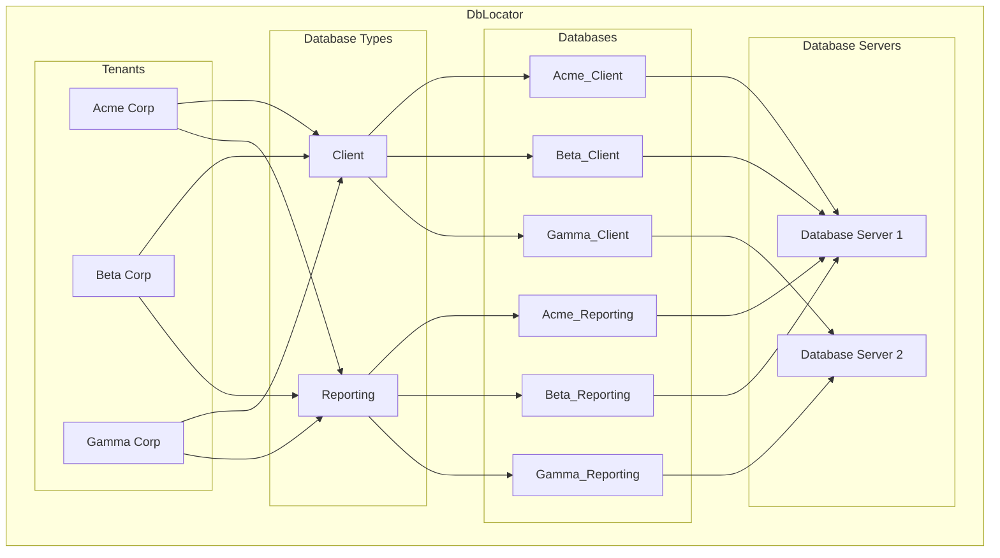

# DbLocator

DbLocator is a .NET library that simplifies database interactions for multi-database tenant applications on SQL Server.

## 📊 Architecture



## 📚 Documentation

Full documentation is available at [https://chizer1.github.io/DbLocator](https://chizer1.github.io/DbLocator)

## 🚀 Quick Start

### Installation

The package is available on [NuGet](https://www.nuget.org/packages/DbLocator):

```bash
dotnet add package DbLocator
```

### Basic usage

```csharp
var connectionString = "{yourConnectionString}";
var dbLocator = new Locator(connectionString);

var tenantCode = "Acme";
var tenantId = await dbLocator.CreateTenant(
    tenantName: "Acme Corp",
    tenantCode: tenantCode,
    tenantStatus: Status.Active
);

var databaseTypeName = "Client";
var databaseTypeId = await dbLocator.CreateDatabaseType(databaseTypeName: databaseTypeName);

var databaseServerId = await dbLocator.CreateDatabaseServer(
    databaseServerName: "Database Server",
    databaseServerHostName: "localhost",
    databaseServerIpAddress: null,
    databaseServerFullyQualifiedDomainName: null,
    isLinkedServer: false
);

var databaseId = await dbLocator.CreateDatabase(
    databaseName: $"{tenantCode}_{databaseTypeName}",
    databaseServerId: databaseServerId,
    databaseTypeId: databaseTypeId,
    affectDatabase: true,
    useTrustedConnection: true
);

await dbLocator.CreateConnection(
    tenantId: tenantId,
    databaseTypeId: databaseTypeId
);

using var connection = await dbLocator.GetConnection(
    tenantId: tenantId,
    databaseTypeId: databaseTypeId
);

using var command = connection.CreateCommand();
command.CommandText = "SELECT * FROM Users";

using var reader = await command.ExecuteReaderAsync();
while (await reader.ReadAsync())
    Console.WriteLine($"User: {reader["Name"]}");
```

## 📖 Examples

- [DbLocatorExample](https://github.com/chizer1/DbLocatorExample)
- [aspire-multi-tenant-starter](https://github.com/chizer1/aspire-multi-tenant-starter)

## 🤝 Contributing

I welcome contributions! Here's how you can help:

1. Fork the repository
2. Create your feature branch (`git checkout -b feature/amazing-feature`)
3. Commit your changes (`git commit -m 'Add some amazing feature'`)
4. Push to the branch (`git push origin feature/amazing-feature`)
5. Open a Pull Request

Please read [Contributing Guidelines](CONTRIBUTING.md) for more details.

## 📝 License

This project is licensed under the MIT License - see the [LICENSE](LICENSE) file for details.
